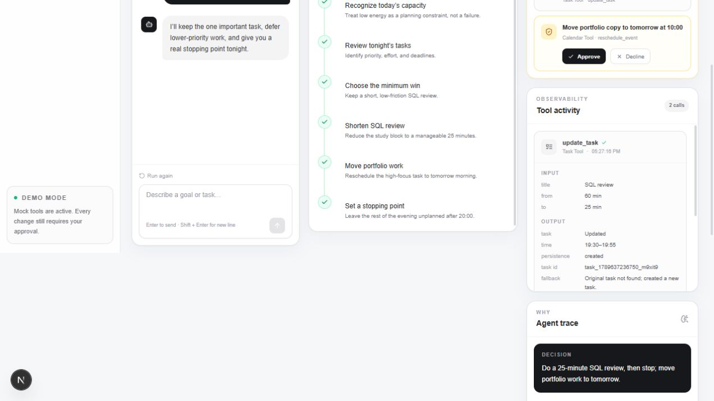
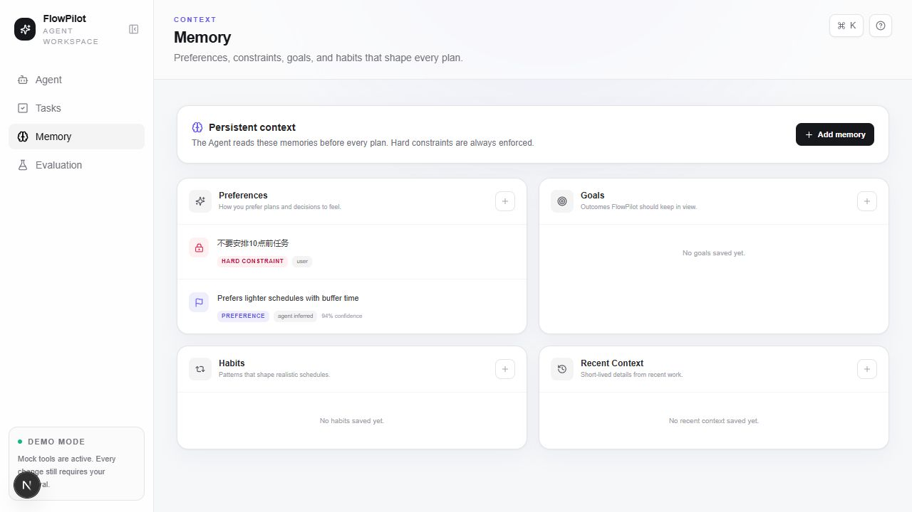
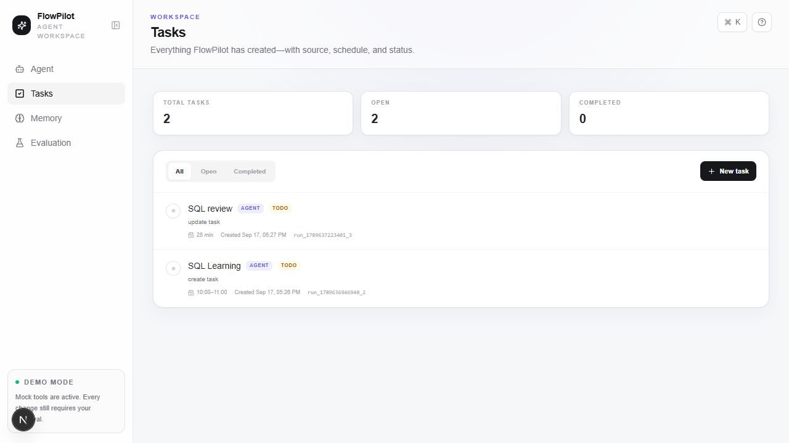

# FlowPilot

> An AI-native task collaboration Agent for planning, tool use, memory, approval, and explainable execution.

FlowPilot 是一个面向个人任务规划的 AI Agent 产品原型。它探索的不只是“如何回答用户”，而是当 Agent 开始规划任务、调用工具和修改用户数据时，如何让整个过程保持可观察、可控制、可解释，并且能够被系统化评估。

```text
Understand → Plan → Read Memory → Validate Constraints → Use Tools
→ Ask for Approval → Execute → Persist → Explain → Evaluate
```

## Overview

FlowPilot 围绕以下 Agent 产品问题展开：

- 如何把复杂目标拆解为可执行步骤？
- 如何向用户展示 Agent 当前正在做什么？
- 哪些工具操作可以直接执行，哪些必须经过确认？
- 长期偏好和硬约束应如何影响后续计划？
- 用户如何理解 Agent 的决策依据和执行结果？
- 如何通过测试、失败分析和迭代记录评估 Agent 体验？

当前版本是一套纯前端、可运行的作品集 Demo，重点验证 Agent UX 和产品机制，而不是模拟完整的生产级 Agent 基础设施。

## Demo

### Live Demo

[https://flowpilot-agent.vercel.app](https://flowpilot-agent.vercel.app)

### Portfolio

[profound-torrone-507c6b.netlify.app](https://profound-torrone-507c6b.netlify.app/)

## Product Walkthrough

### Planning, approval, tool activity, and visible fallback



### Memory-aware Agent Trace


### Persistent Memory workspace



### Persistent Tasks workspace



## Core Experience

### 1. Task Planning

用户可以直接描述一个目标，例如：

> 我明天下午 3 点在深圳面试，还要学习 SQL，帮我安排一下。

FlowPilot 会选择匹配的 deterministic scenario，将目标拆解为一组计划步骤，并逐步展示状态变化：

- `pending`
- `running`
- `completed`

页面不会一次性展示最终结果，而是让用户看到理解目标、读取日历、查询天气、估算路线和准备写操作的过程。

### 2. Mock Tool Use

项目定义了 4 类 Mock Tool：

| Tool | Operations |
| --- | --- |
| Calendar Tool | `get_calendar`, `create_event`, `reschedule_event` |
| Task Tool | `create_task`, `update_task`, `complete_task` |
| Weather Tool | `get_weather` |
| Route Tool | `estimate_route` |

只读操作可以直接完成；写操作会进入 Pending Approval。已执行的 Tool Activity 会展示 Tool Name、operation、input、output 和 timestamp。若 `update_task` 或 `reschedule_event` 找不到原任务，系统会创建新任务，并在 Tool Activity 和 Agent Trace 中明确记录 fallback。

这些工具当前均为本地模拟，不会连接真实 Calendar、Weather 或 Maps 服务。

### 3. Approval and User Control

所有会修改数据的操作都必须先进入 Pending Approval：

```text
Proposed write action
        ↓
Pending Approval
   ↙           ↘
Decline       Approve
  ↓              ↓
No write     Execute once
```

当前实现保证：

- Approval 前不写入 Tasks Repository；
- Approve 后执行对应 mock write，并保存结果；
- Decline 不产生任务副作用；
- 同一 approval 不会被重复执行；
- fallback 会作为执行结果的一部分向用户解释。

### 4. Persistent Memory

Memory 分为四类：

- Preference
- Goal
- Habit
- Recent Context

Memory 页面支持新增、编辑、删除、Hard Constraint 切换、来源展示，以及可选 confidence 的录入和展示。Memory 会保存在 localStorage，并在下一次规划前被读取。

```ts
type Memory = {
  id: string;
  type: "preference" | "goal" | "habit" | "recent_context";
  content: string;
  isHardConstraint: boolean;
  source: "user" | "agent_inferred" | "demo_seed";
  confidence?: number;
  createdAt: string;
  updatedAt: string;
};
```

### 5. Hard Constraint vs. Soft Preference

FlowPilot 区分必须满足的 Hard Constraint 和用于优化计划的 Soft Preference。

```text
Hard Constraint
Don't schedule anything before 10 AM.

Soft Preference
I prefer lighter schedules with buffer time.
```

当前 Constraint Validator 具体支持“不得早于某个时间安排任务”的 time-floor 约束。如果计划中的写操作早于限制时间，系统会在生成 approval 前调整时间，并在 Memory Influence 中说明修改原因。用户也可以在 Memory 页面手动开启或关闭 Hard Constraint。

普通 Preference 不会强制覆盖计划。例如保存“不喜欢日程太满”后，Memory-aware demo 会在两个专注任务之间增加 30 分钟缓冲。

### 6. Agent Trace and Memory Influence

Agent Trace 展示：

- Goal
- Constraints
- Tools Used
- Decision
- Reasons
- Memory Influence
- Execution Notes（存在 fallback 时）

Memory Influence 会区分：

- `Hard Constraint · Enforced`
- `Preference · Optimized`

因此，用户不仅能看到 Agent 做了什么，也能看到哪些 Memory 影响了计划、如何影响，以及计划是否被校验或修正。

### 7. Tasks Repository

批准后的 Task Tool 和 Calendar Tool mock write 会写入统一的 Tasks Repository。Tasks 页面支持：

- Create
- Edit
- Complete and reopen
- Delete
- Filter by status
- Source and run tracking

```ts
type Task = {
  id: string;
  title: string;
  description?: string;
  scheduleLabel?: string;
  scheduledStart?: string;
  scheduledEnd?: string;
  status: "todo" | "completed";
  source: "agent" | "user";
  sourceRunId?: string;
  createdAt: string;
  updatedAt: string;
  completedAt?: string;
};
```

Tasks 通过 localStorage 持久化，刷新页面后仍然保留。

## Agent Experience Evaluation

Evaluation Dashboard 使用七个维度评估 Agent 体验：

- Intent Understanding
- Task Planning
- Tool Use
- Context Consistency
- User Control
- Memory Compliance
- Constraint Compliance

每项评分范围为 1–5，并汇总为 Overall Score。当前 fixture suite 包含 **16 个固定测试 Case**，覆盖：

- Single Task
- Multi-task Planning
- Time Constraint
- Hard Constraint
- Soft Preference
- Memory Recall
- Multi-turn Context
- Tool Use
- Conflicting Constraints
- Abnormal Input

每个 Case 至少包含：

```ts
type EvaluationTestCase = {
  id: string;
  title: string;
  category: TestCategory;
  userInput: string;
  expectedBehavior: string;
  applicableMetrics: EvaluationMetric[];
  setup?: EvaluationSetup;
  assertions: EvaluationAssertion[];
};
```

评分由 `DeterministicEvaluator` 根据固定 assertion fixture 生成。Dashboard 依赖统一的 `EvaluatorAdapter`，未来可以增加人工评估或 LLM Judge，而不需要改写页面消费的数据结构。

### Failure Analysis

低分 assertion 可以生成只读 Failure Case，包括：

- User Input
- Expected Behavior
- Actual Behavior
- Failure Type
- Severity
- Root Cause
- Suggested Fix
- Created At
- Open or resolved status

支持的 Failure Type：

```text
Intent Error
Planning Error
Tool Error
Memory Violation
Constraint Violation
Context Loss
UX Issue
```

### Before / After Iteration

Evaluation 页面预置了一个历史 Constraint Violation：用户要求“不安排 10 点前任务”，但旧版本计划创建了 `09:30 SQL Learning`。

```text
Before
09:30 SQL Learning
        ↓
Root Cause
Plan bypassed hard-constraint validation
        ↓
Fix
Run the validator before Pending Approval
        ↓
After
10:00 SQL Learning + visible Trace explanation
```

这一模块将产品迭代表达为可复现的 `Test → Failure → Root Cause → Fix → Verification` 链路。

## Architecture

FlowPilot 将运行时 Agent 闭环和 Evaluation 闭环分开，Evaluation fixture 不会读取或修改真实 Tasks 和 Memory。

```text
Runtime Agent flow

User Input
    ↓
Deterministic Scenario Selection
    ↓
Memory Repository Read
    ↓
Memory-aware Planning + Time-floor Validation
    ↓
Animated Plan Steps
    ↓
Mock Tool Calls
    ├── Read operation → Tool Activity
    └── Write operation → Pending Approval
                              ↓
                         User Decision
                          ↙         ↘
                     Decline       Approve
                                      ↓
                              Task Repository
                                      ↓
                             Tool Activity + Trace

Evaluation flow

Test Cases + Versioned Fixtures
              ↓
      Evaluator Adapter
              ↓
   Deterministic Evaluator
              ↓
Scores + Failures + Iteration Evidence
              ↓
     Evaluation Dashboard
```

## Data Architecture

Tasks 和 Memory 使用 typed localStorage repositories，并通过 React `useSyncExternalStore` 订阅数据：

```text
UI components
     ↓ subscribe / commands
Typed Repository
     ↓ serialize / validate
localStorage
```

实际使用的 storage keys：

```text
flowpilot.tasks.v1
flowpilot.memories.v1
```

这一边界提供：

- Agent、Tasks 和 Memory 页面共享同一数据源；
- 刷新后恢复数据；
- 同一页面中的订阅更新；
- 浏览器 `storage` event 驱动的跨标签页同步；
- Repository 与 UI 分离，便于未来替换持久化实现。

Evaluation fixtures 是独立、只读的数据集，不存入上述 localStorage repositories。

## Tech Stack

### Frontend

- Next.js 16.3
- React 19
- TypeScript 5.7
- Tailwind CSS 3.4
- Lucide React

### State and Persistence

- React `useSyncExternalStore`
- Typed repository abstraction
- Browser localStorage

### Quality

- Vitest
- TypeScript compiler checks
- Next.js production build

## Project Structure

```text
app/                  # Next.js routes: Agent, Tasks, Memory, Evaluation
agent/                # Scenario selection, memory planning, task execution
components/
  agent/              # Planning, approval, tool activity, trace
  tasks/              # Persistent task workspace
  memory/             # Persistent memory workspace
  evaluation/         # Dashboard, metrics, failures, iterations
data/                  # Demo cases, repositories, evaluation fixtures
evaluation/            # Evaluator adapter, scoring, failure mapping
tools/                 # Mock tool definitions
types/                 # Agent, persistence, and evaluation types
docs/
  screenshots/        # Portfolio screenshots
  plans/              # Phase design notes
```

## Testing

Current verified status:

```text
npm run lint   # Runs: tsc --noEmit
✓ Passed

npm test
✓ 21 / 21 tests passed across 5 test files

npm run build
✓ Passed
```

`npm run lint` 当前是 TypeScript 静态类型检查脚本，并非 ESLint。

测试覆盖：

- Persistent Repository CRUD and hydration
- Malformed localStorage recovery
- Repository subscription updates
- Hard Constraint detection and time correction
- Manual Hard Constraint override
- Soft Preference inference and influence
- Task creation, update, and missing-target fallback
- Memory deduplication
- Deterministic evaluation scoring and status thresholds
- Metric aggregation and applicable-metric isolation
- Failure generation and resolved history
- Evaluator determinism and input immutability

## Built-in Demo Scenarios

| Scenario | Demonstrates |
| --- | --- |
| Interview Day | Calendar, weather, route, SQL planning, approvals, travel buffer |
| Weekly Focus | Multi-task planning, workload ceiling, sustainable SQL routine |
| Low-energy Evening | Re-planning, task update, reschedule fallback, stopping point |
| Memory-aware Planning | Preference capture, persistence, recall, and visible influence |

Memory-aware Planning 是两步 Demo：先告诉 Agent“我不喜欢日程太满”，再发起新的规划请求。第二次请求不需要重复偏好，Agent 会从 Memory Repository 读取它并加入缓冲时间。

## Getting Started

```bash
npm install
npm run dev
```

Open [http://localhost:3000](http://localhost:3000).

Additional commands:

```bash
npm run lint
npm test
npm run build
npm start
```

## Product Principles

1. **Observable actions** — 用户应当知道 Agent 正在做什么、调用了什么工具。
2. **Explicit control** — 影响用户数据的操作必须经过批准。
3. **Explainable decisions** — Trace 应说明目标、约束、原因和 Memory Influence。
4. **Behavioral memory** — Memory 不只是存储文本，还应影响后续计划。
5. **Constraint clarity** — Hard Constraint 和 Soft Preference 具有不同执行语义。
6. **Measurable quality** — Agent 体验需要测试、失败分析和迭代证据。

## Current Limitations

FlowPilot 当前是一个 **AI Agent product prototype**，不是生产级 autonomous agent。

- Agent 规划基于预设的 deterministic scenarios 和规则匹配，而非真实 LLM 动态推理；
- Calendar、Task、Weather 和 Route Tools 均为 Mock Tools；
- 没有连接真实 Calendar、Weather、Maps 或任务管理服务；
- Evaluation 使用固定 Case、versioned fixture 和 deterministic evaluator，不是实时运行的 LLM-as-a-Judge；
- Evaluation fixture 与用户本地 Tasks/Memory 隔离，不代表对当前个人数据进行在线评测；
- Hard Constraint Validator 当前重点支持“不得早于某个时间”的 time-floor 场景，不是通用约束求解器；
- 数据仅保存在当前浏览器的 localStorage，没有账号、云同步或服务端数据库；
- 当前测试集中在 repository、planning、execution 和 evaluation 的纯逻辑层，没有端到端浏览器自动化测试。

这些限制是有意的范围选择：先验证 Planning、Approval、Memory、Trace 和 Evaluation 的产品体验，再增加模型与外部服务复杂度。

## Future Exploration

- Real LLM planner adapter
- Calendar, Weather, and Route integrations
- General constraint solver
- Semantic memory retrieval
- Human evaluation workflow
- LLM-as-a-Judge adapter
- End-to-end browser tests
- Account-based cloud persistence

## Why I Built This

这个项目来自一个产品问题：

> 如果 AI 不再只是回答问题，而是开始替用户做事情，我们应该如何设计一个值得信任的 Agent？

FlowPilot 重点关注执行前的控制、执行中的可观察性、决策后的可解释性，以及失败后的系统化评估。它是我对 Agent Product、Human–AI Interaction 和 AI-native workflow 的一次完整产品实验。

## Author

**熊启懿**

Master's Student at South China University of Technology

Focus: AI Product · Agent Experience · AIGC · Data Analysis · Human–AI Interaction

Portfolio: [profound-torrone-507c6b.netlify.app](https://profound-torrone-507c6b.netlify.app/)
